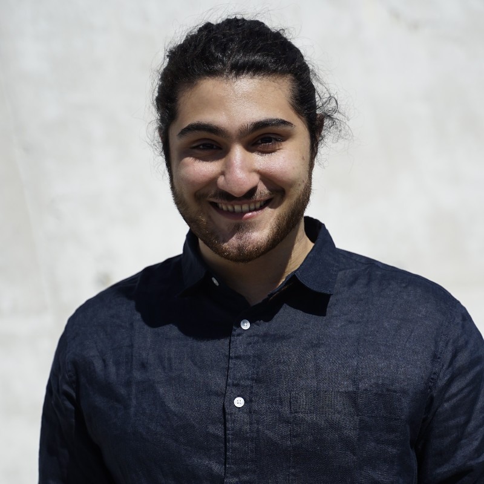

## [About](index.md) |  [Portfolio](portfolio.md) | [Contact](contact.md)

I received my Bachelor's degree from the [Lassonde School of Engineering](https://lassonde.yorku.ca/), [York University](https://www.yorku.ca/), where I designed and implemented a soil sample collector for a rover participating in the [Canadian International Rover Challenge](https://circ.cstag.ca/) under the supervison of [Franz Newland](https://lassonde.yorku.ca/users/franz-newland).
