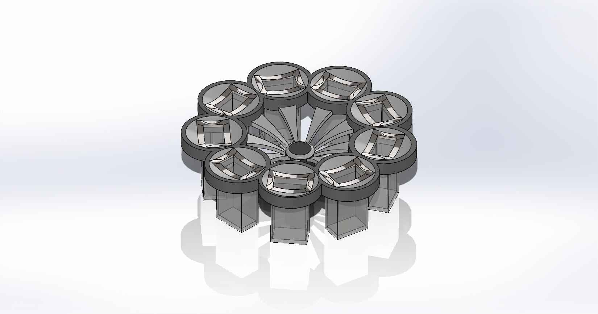
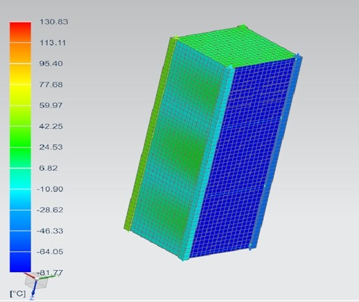

## [About](index.md) |  [Portfolio](portfolio.md) | [Contact](contact.md)

- 2022
  - Soil sample collector
    - Conceptualized and designed sustainable solutions for drilling, collecting, and storing different soil samples for a rover involved in Canadian International Rover Challenge
    - Communicated with stakeholders and costumers, drafted project documentations at various stages of product development including PCR, and assigned tasks to team members based on their qualifications and abilities to guarantee a suitable design
    - Designed the final solution in SolidWorks and conducted environmental testing, safety and fault analysis, including thermal to validate the performance of equipment under different conditions
      
        
        

- 2021
  - SpaceCraft analysis
    - Analyzed physical and surface properties of different materials used on a CubeSat, to compute thermal loads applied to its surfaces while orbiting the Earth
    - Measured cold and hot heat dissipation using Siemens NX software for a better understanding of heat behavior for different materials in space and vacuum for durability checks

        
        
        
- 2020
  - Boeing 787 wing flaps
  
       
