## [About](index.md) |  [Portfolio](portfolio.md) | [Contact](contact.md)

- 2023
  - General Atomics MQ-1 Predator
    - Designed and conceptualized the MQ-1 Predator drone 
    - Studied the air flow and pressure simulation on the drone in STP (Standard Temperature and Pressure) 
    
        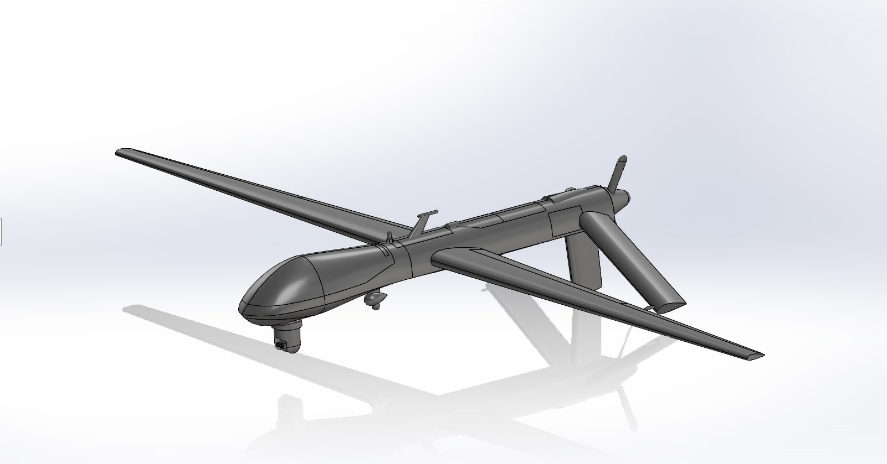
        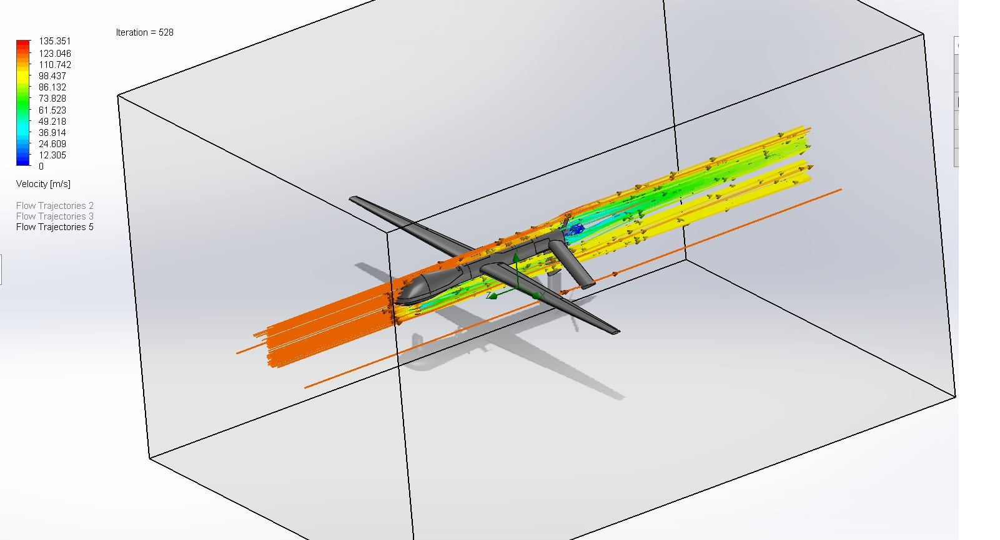
        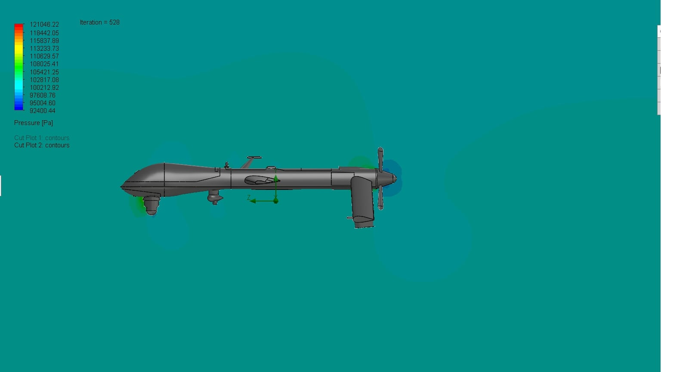
        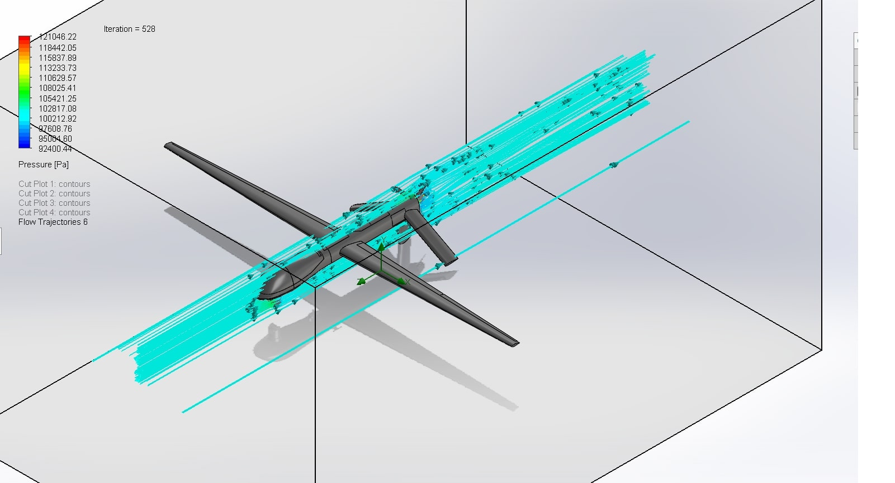

- 2023
  - House HVAC System
    - Designed an HVAC system for a 3-bedroom house 
    - Taking to account the layout of the rooms for an optical heating system
      
        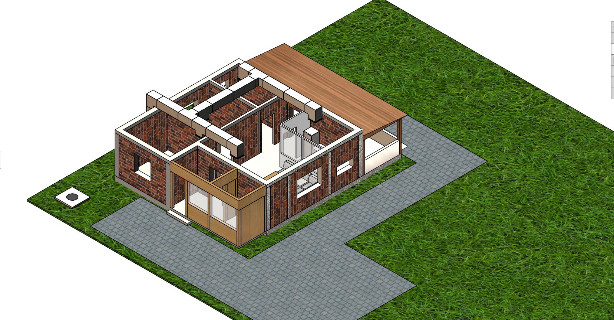
        
        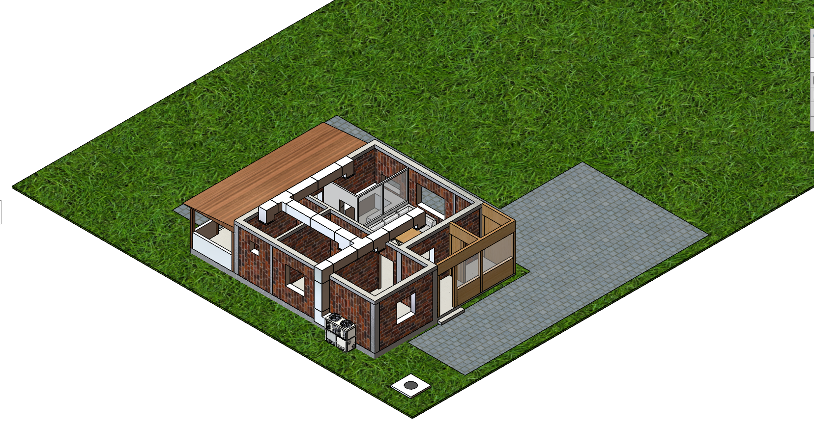
    
- 2022
  - Soil sample collector
    - Conceptualized and designed sustainable solutions for drilling, collecting, and storing different soil samples for a rover involved in Canadian International Rover Challenge
    - Communicated with stakeholders and costumers, drafted project documentations at various stages of product development including PCR, and assigned tasks to team members based on their qualifications and abilities to guarantee a suitable design
    - Designed the final solution in SolidWorks and conducted environmental testing, safety and fault analysis, including thermal to validate the performance of equipment under different conditions
      
        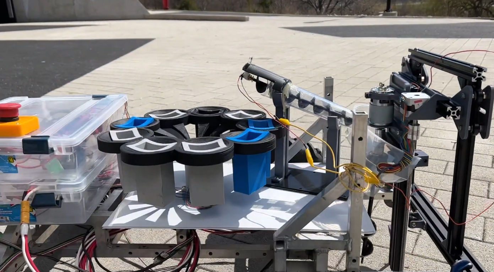
        
        
- 2022
  - Load Carrying Truss Design
    - Designed a truss structure constructed out of Steel and Aluminum material to support and carry a 3000 N load
    - Applied fatigue analysis and fracture mechanics, stress analysis and mass efficiency analysis using Abaqus FEA
    - Implemented MATLAB program to automate the truss nodal displacement process
      
        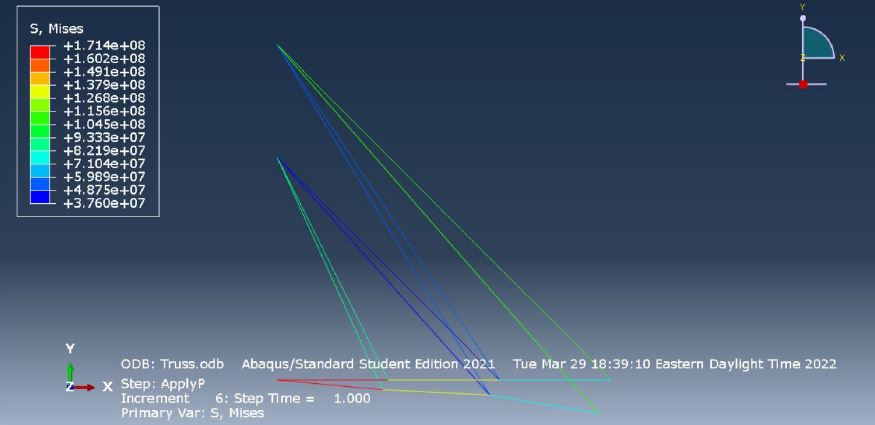
        

- 2021
  - SpaceCraft analysis
    - Analyzed physical and surface properties of different materials used on a CubeSat, to compute thermal loads applied to its surfaces while orbiting the Earth
    - Measured cold and hot heat dissipation using Siemens NX software for a better understanding of heat behavior for different materials in space and vacuum for durability checks

        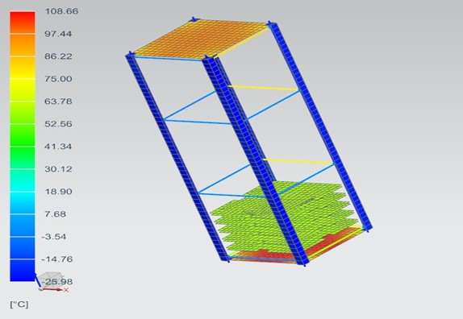
        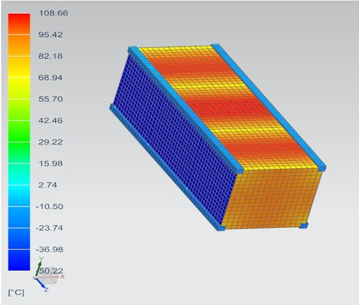
        
- 2020
  - Boeing 787 wing flaps
    - Designed the aileron flaps inspired by Boeing 787 wing flaps
    - Animated the trajectory and the motion from closed to fully open
    - Optimized the link length and the degree of freedom
    - Programmed the mechanism to take input from the potentiometer and cycle through max and min extentions automatically
       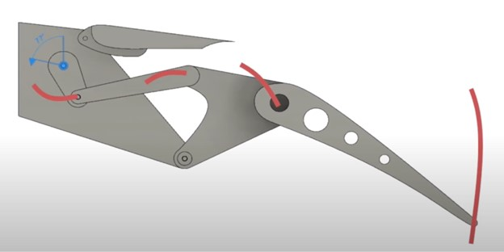
       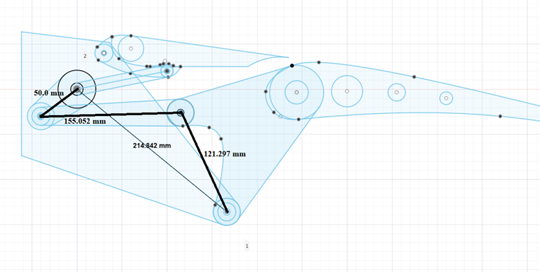
